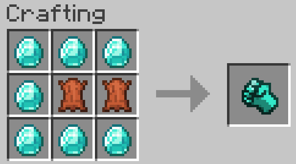

# Almighty Fist

A mod for Minecraft made with Fabric (mostly to test the waters with the Fabric API)

This mod adds a tool that can mine every mineable block very quickly. It can be enchanted with
- Unbreaking
- Mending
- Efficieny
- Fortune
- Silk Touch
- Curse of Vanishing